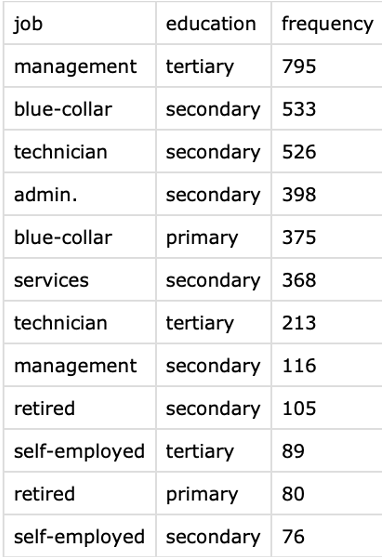

# MIS-Bank-Marketing-Data-Analysis-Project
This analysis explored the effectiveness of banking marketing campaigns using a relational database built with PostgreSQL. The insights below focus on customer behavior, campaign strategies, and key factors influencing success.

## Overview
This project analyzes customer subscription patterns in a banking marketing dataset using PostgreSQL. 
The goal is to derive actionable insights to optimize campaign strategies.

## Features
- Relational database design and implementation.
- Analysis of 40,000+ records to uncover patterns in customer behavior.
- Key focus on call durations, contact methods, and financial attributes.

## Project Highlights
- Discovered the actionable insights for the business to perform and achieve higher targeting performance
- Normalized and structured raw data for enhanced usability.
- Visualized insights using Tableau and Excel.

## Tools Used
- PostgreSQL: Relational database for data storage and querying.
- SQL: Complex queries for insights on customer behavior and campaign success.
- Tableau/Excel: Visualization of trends and patterns.

# Problem statement
### Current Situation
Banks rely heavily on marketing campaigns to promote their financial products. However, intense competition in the market, driven by factors such as fluctuating interest rates on mortgage and certificate of deposit (CD) products and the increasing reliance on digital platforms, has made it challenging for banks to attract customers. Additionally, many banks are no longer hiring traditional bankers due to emerging technological innovations that allow customers to independently compare financial products and apply for them online. Therefore, an effective marketing strategy has become crucial for banks to remain competitive in the market

Despite significant investments in marketing, banks often struggle with low conversion rates, as many campaigns fail to successfully convert leads into customers. Furthermore, insufficient targeting leads to higher costs and reduced return on investment (ROI), ultimately impacting the overall performance of marketing campaigns and business profitability.

### Business Problem
In this competitive landscape, banks need effective strategies to attract and retain customers who are more likely to subscribe to term deposit products. 

Achieving this requires identifying key factors influencing customer decisions and optimizing marketing efforts to focus on high-potential leads, thereby enhancing conversion rates and reducing costs.

### Goal
The goal is to develop a database system that supports predictive analytics, enabling banks to derive actionable insights for improved customer targeting. By analyzing data, the system aims to predict with greater accuracy whether a client is likely to subscribe to a term deposit through direct marketing campaigns.

# Data Exploration
## Dataset
- Source: [Bank Marketing Dataset] (https://archive.ics.uci.edu/ml/datasets/Bank+Marketing)
- Authors: Paulo Cortez (Univ. Minho) and Sérgio Moro (ISCTE-IUL), 2012
- Size:
    Rows: 4,521 clients
    Columns: 17 attributes

- Key Attributes
    - Demographics: age, job, marital status, education.
    - Financial Data: balance, housing loan, personal loan.
    - Campaign Details: contact type, day, month, duration, previous outcomes.
    - Target Variable: y (indicates if the customer subscribed to a term deposit: yes/no).  

## Data Cleaning Process
To ensure the dataset is ready for analysis, the following cleaning steps were applied.
1. Handling Missing and Unknown Values:
Certain fields, such as job and education, contained missing or incomplete data labeled as “UNKNOWN.” These accounted for less than 3% of the dataset and were replaced with the most frequently occurring value (mode) for accuracy.

2. Detecting and Managing Outliers:
Outliers were detected in the "balance" attribute using the Interquartile Range (IQR) method.
Extreme values waere either capped or removed to reduce their impact on the analysis

## Data Modeling

This analysis distinguishes three key entities in the dataset: Customer, Campaign, and Customer_Campaign.

- Customer: Represents individual clients. Each customer can participate in multiple campaigns, establishing a one-to-many relationship between customers and campaigns.
- Campaign: Represents marketing efforts. Each campaign records one response per customer, forming a one-to-one relationship between campaigns and customer responses.
- Customer_Campaign: Serves as a linking entity that connects customers to campaigns and tracks their interactions.

By looking at these entities, I was able to come up with some ideas to explore
1. **Customer Profiles** : What customer characteristics or profiles are more likely to result in a subscription to a term deposit?
2. **Campaign Success**: Which campaigns demonstrate the highest success rates in achieving customer subscriptions?
3. **Contact Duration**: How does the duration of contact during a campaign influence its success?

## Data Observation

The analysis of the dataset reveals interesting patterns in customer profiles and their job distribution.

**Educational Influence on Jobs**: As education levels rise, the proportion of individuals in high-skilled occupations, such as "Management," increases significantly. Conversely, roles that are labor-intensive, such as "Blue-collar" jobs, are predominantly associated with individuals who have only primary education. This trend reinforces traditional employment patterns where higher education levels align with greater career mobility and access to skilled job opportunities.

**Educational Insights**: Lower education levels are generally linked to routine or manual labor roles. This observation underscores the importance of education in shaping job prospects and advancing career trajectories.

# Key Findings

### 1. **Call Duration**
- Customers engaged in **long calls (>300 seconds)** had a success rate of **28.19%**, significantly higher than medium (6.86%) or short calls (1.32%).
- **Insight**: Longer calls are more effective in converting customers, suggesting the need for focused and meaningful conversations.

### 2. **Previous Campaign Outcome (`poutcome`)**
- Customers with a successful previous campaign had a **64.34% success rate**, while those with a `failure` had only **12.86%**.
- Customers in the `unknown` category had a **9.10% success rate**, making them the largest but least effective group.
- **Insight**: Previous campaign success is a strong predictor of future conversions, and `unknown` customers need targeted engagement strategies.

### 3. **Communication Method (`contact`)**
- **Telephone** achieved the highest success rate of **14.62%**, followed by `cellular` at **14.36%**. The `unknown` channel underperformed with a **4.61% success rate**.
- **Insight**: Prioritize `telephone` and `cellular` channels for higher engagement and better results.

### 4. **Financial Stability**
- Customers with **no housing loans** or **personal loans** exhibited higher success rates.
- Those not in default had higher average balances, suggesting financial stability plays a critical role in campaign success.
- **Insight**: Financially stable customers are more likely to convert and should be prioritized for targeted marketing.

# Recommendations
1. Focus resources on **longer call durations** and train staff to foster meaningful interactions.
2. Develop personalized re-engagement strategies for customers with `unknown` or `failure` outcomes.
3. Prioritize **telephone** and **cellular** channels while improving data quality for `unknown` contacts.
4. Use financial stability indicators (e.g., balance, loan status) to segment and target high-value customers.

## Repository Structure
- `data/`: Contains the original dataset.
- `sql_scripts/`: SQL scripts for creating tables, inserting data, and running queries.
- `analysis/`: Insights and visualizations derived from the analysis.
- `docs/`: Final presentation and report documents.

## Contact
If you have any questions, feel free to reach out:
- Name: Jiyun Nam
- Email: jnam4@stevens.edu
- LinkedIn: linkedin.com/jiyunnam