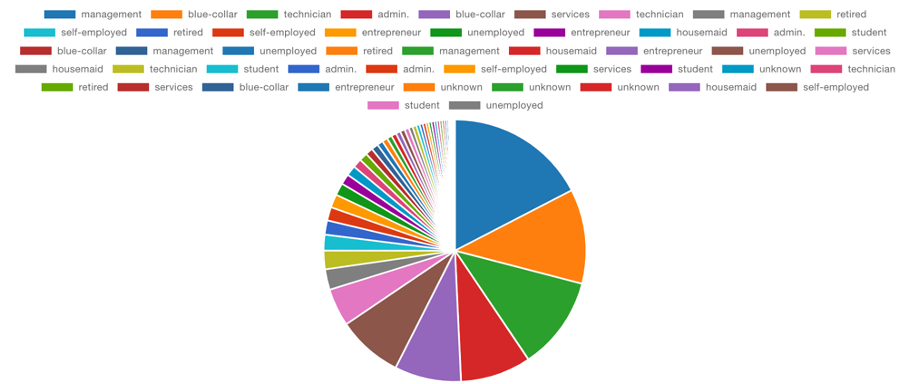

# MIS-Bank-Marketing-Data-Analysis-Project
Relational database and analysis for banking marketing dataset using PostgreSQL.

## Overview
This project analyzes customer subscription patterns in a banking marketing dataset using PostgreSQL. The goal is to derive actionable insights to optimize campaign strategies.
### Current Situation
Banks rely heavily on marketing campaigns to promote their financial products. However, intense competition in the market, driven by factors such as fluctuating interest rates on mortgage and certificate of deposit (CD) products and the increasing reliance on digital platforms, has made it challenging for banks to attract customers. Additionally, many banks are no longer hiring traditional bankers due to emerging technological innovations that allow customers to independently compare financial products and apply for them online. Therefore, an effective marketing strategy has become crucial for banks to remain competitive in the market

Despite significant investments in marketing, banks often struggle with low conversion rates, as many campaigns fail to successfully convert leads into customers. Furthermore, insufficient targeting leads to higher costs and reduced return on investment (ROI), ultimately impacting the overall performance of marketing campaigns and business profitability.

### Business Problem
In this competitive landscape, banks need effective strategies to attract and retain customers who are more likely to subscribe to term deposit products. 

Achieving this requires identifying key factors influencing customer decisions and optimizing marketing efforts to focus on high-potential leads, thereby enhancing conversion rates and reducing costs.

### Goal
The goal is to develop a database system that supports predictive analytics, enabling banks to derive actionable insights for improved customer targeting. By analyzing data, the system aims to predict with greater accuracy whether a client is likely to subscribe to a term deposit through direct marketing campaigns.

## Features
- Relational database design and implementation.
- Analysis of 40,000+ records to uncover patterns in customer behavior.
- Key focus on call durations, contact methods, and financial attributes.

## Project Highlights
- Discovered the actionable insights for the business to perform and achieve higher targeting performance
- Normalized and structured raw data for enhanced usability.
- Visualized insights using Tableau and Excel.

## Repository Structure
- `data/`: Contains the original dataset.
- `sql_scripts/`: SQL scripts for creating tables, inserting data, and running queries.
- `analysis/`: Insights and visualizations derived from the analysis.
- `docs/`: Final presentation and report documents.
- 
## Dataset
- [Bank Marketing Dataset] (https://archive.ics.uci.edu/ml/datasets/Bank+Marketing)
- Created by Paulo Cortez (Univ. Minho) and Sérgio Moro (ISCTE-IUL) @ 2012
- bank-full.csv: all examples, ordered by date (from May 2008 to November 2010)
- bank.csv: 10% of the examples (4521), randomly selected from bank-full.csv
- **Rows**: Represent the total number of clients, 4521 
- **Columns**: 17 attributes
    Key Attributes
    - Demographics: age, job, marital status, education.
    - Financial Data: balance, housing loan, personal loan.
    - Campaign Details: contact type, day, month, duration, previous outcomes.
    - Target Variable: y (indicates if the customer subscribed to a term deposit: yes/no).
    

## Data Modeling
 
This analysis distinguishes three key entities in the dataset: Customer, Campaign, and Customer_Campaign.

- Customer: Represents individual clients. Each customer can participate in multiple campaigns, establishing a one-to-many relationship between customers and campaigns.
- Campaign: Represents marketing efforts. Each campaign records one response per customer, forming a one-to-one relationship between campaigns and customer responses.
- Customer_Campaign: Serves as a linking entity that connects customers to campaigns and tracks their interactions.

By looking at these entities, I was able to come up with some ideas to explore
1. **Customer Profiles** : What customer characteristics or profiles are more likely to result in a subscription to a term deposit?
2. **Campaign Success**: Which campaigns demonstrate the highest success rates in achieving customer subscriptions?
3. **Contact Duration**: How does the duration of contact during a campaign influence its success?

## Tools Used
- PostgreSQL
- Tableau
- Python
- Excel

## Contact
If you have any questions, feel free to reach out:
- Name: Jiyun Nam
- Email: jnam4@stevens.edu
- LinkedIn: linkedin.com/jiyunnam